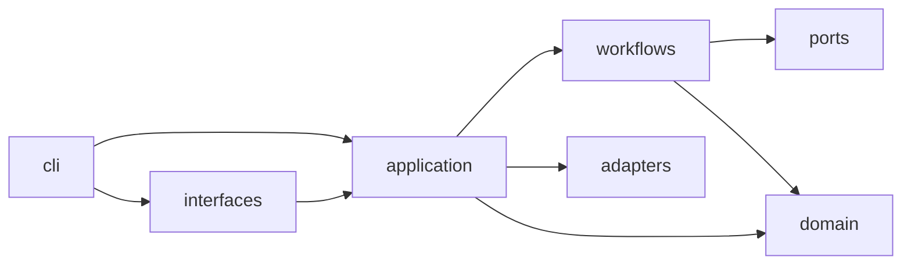

# Upgrade Agent Architecture

This repository follows a layered architecture with explicit dependency boundaries.

## Layers

- `upgrade_agent/cli`: command-line entrypoint and argument parsing.
- `upgrade_agent/interfaces`: presentation concerns (console rendering).
- `upgrade_agent/application`: orchestration, factories, and use cases.
- `upgrade_agent/ports`: protocol interfaces consumed by core workflows.
- `upgrade_agent/workflows`: core business pipelines.
- `upgrade_agent/domain`: pure configuration and option models.
- `upgrade_agent/adapters`: concrete integrations (HAC, log reading, parsing, reporting).

## Dependency Rules

- `domain` depends on standard library only.
- `workflows` depend on `domain` and `ports`, never on `adapters` directly.
- `application` wires adapters into workflows through ports.
- `cli` calls application coordinator only.

## Dependency Flow



## Boundary Validation

Architecture boundary checks live in `tests/architecture/test_import_boundaries.py`.
Run:

```bash
python3 -m unittest tests/architecture/test_import_boundaries.py
```
