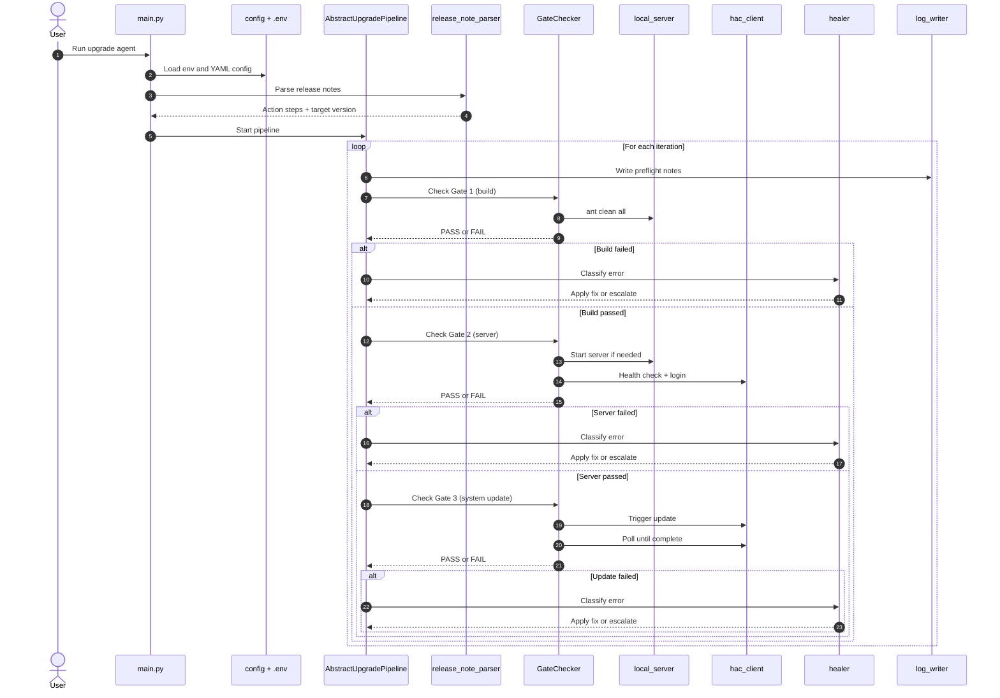

# SAP Commerce Upgrade Agent Template - How to Use
# SAP Commerce Upgrade Agent Template - How to Use

This folder contains a self-healing upgrade runner for SAP Commerce upgrade work. It is a template, not a project-specific copy.

## What it is

Main parts:
- `main.py` - CLI entry point
- `pipeline.py` - release-note-driven 3-gate loop
- `gate_checker.py` - build, server, and system-update checks
- `hac_client.py` - HAC login, Groovy, and system-update calls
- `local_server.py` - ant build and server start/stop helpers
- `healer.py` - known-error classifier and fix executor
- `healing_map.yaml` - local fix rules
- `config/*.yaml` - environment settings
- `knowledge/upgrade-log-template.md` - template upgrade log reference

## What it does

The agent follows this sequence:
1. Reads SAP release notes and extracts action steps.
2. Checks Gate 1: build.
3. Checks Gate 2: server health and HAC login.
4. Checks Gate 3: system update.
5. If a gate fails, it tries a known fix.
6. If the fix works, it retries the gate.
7. If it cannot fix the error, it escalates with a report.

Treat every config file and local path as user-owned input. Use only with the right permissions, replace all placeholders, and keep the implementation focused on context engineering rather than hardcoding project details.

## Sequence diagram



## How to run

### 1. Install dependencies

```bash
pip install -r requirements.txt
```

### 2. Copy the environment file

```bash
cp .env.example .env.demo
```

Set the HAC password and, if you want LLM-assisted classification, set an API key.

### 3. Pick a config

Use one of these:
- `config/local.yaml`
- `config/demo-asis.yaml`
- `config/demo-tobe.yaml`
- `config/d1.yaml`
- `config/d2.yaml`
- `config/p1.yaml`

### 4. Run the agent

Release-note-driven mode:

```bash
python main.py \
  --env demo-tobe \
  --env-file .env.demo \
  --release-notes /path/to/release-notes.txt \
  --upgrade-log /path/to/upgrade-LOG.md \
  --max-iterations 3
```

Gates-only mode:

```bash
python main.py --env demo-tobe --env-file .env.demo --gates-only
```

Classic phase mode:

```bash
python main.py --env demo-tobe --env-file .env.demo --phase 3
```

## LLM key question

Yes, it can work without an LLM API key.

What happens without a key:
- The agent still runs.
- It still uses `healing_map.yaml` regex rules.
- It still starts the server, checks gates, retries, and writes logs.
- Only the optional AI suggestion/classification path is skipped.

Supported fallback behavior:
- `ANTHROPIC_API_KEY` not set: Claude-assisted classification is disabled.
- `OPENAI_API_KEY` not set: OpenAI-assisted classification is disabled.
- `litellm` missing: AI classification is disabled, local rules still work.

So yes, you can run it from VS Code terminal or normal command line the same way you do now. No GitHub/Claude integration is required for the core flow.

## What to tell the internal community

Use this short message:

"This folder contains a SAP Commerce upgrade agent template. It runs from the command line, uses config files and release notes, and can operate even without an LLM API key because it has a built-in regex healing fallback."